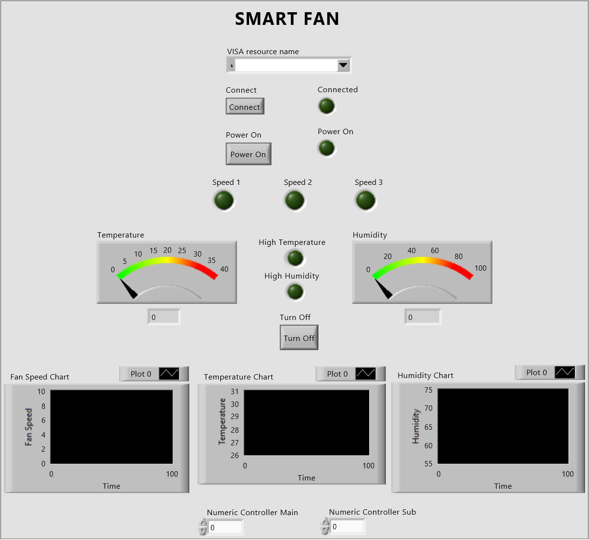

# Smart-Fan
### Smart Fan: Adaptive Comfort with Intelligent Environmental Sensing

</img>

## Introduction

This project introduces a Smart Fan, which intelligently adapts its rotation and speed based on real-time environmental data and user presence. The system leverages computer vision for distance measurement and rotation angle to optimize airflow, enhancing user comfort while conserving energy.

## Project Philosophy

The goal of this project is to fuse modern sensing technology creating smart systems that respond dynamically to environmental changes. By utilizing computer vision and data acquisition technologies with sensors(one custom built) and actuators, this Smart Fan offers an innovative approach to personalized comfort and energy efficiency.

## Tech Stack

[](https://www.python.org/)
[](https://opencv.org/)
[](https://google.github.io/mediapipe/)
[](https://www.ni.com/en-us/shop/labview.html)
[](https://www.debian.org/)

## Features
- **Distance-Based Speed Control**: Generates PWM signals based on the user's distance, enabling precise fan speed adjustments.
- **Adaptive Rotation**: The fan adjusts its rotation angle based on user location within a 4-meter range.
- **Environmental Sensing**: Monitors and adjusts fan operation based on temperature and humidity.
- **User-Friendly Interface**: Provides manual control through LabVIEW for customizable settings.
- **Energy Efficiency**: Reduces energy consumption by dynamically adjusting fan operations.

## Documentation

The block diagram below illustrates how the components of the Smart Fan system interact:

</img>

- **Raspberry Pi**: Processes video input from the webcam for face detection using OpenCV and MediaPipe, calculates distance, and controls the fan's rotation angle.
- **Webcam**: Captures real-time video to detect user presence.
- **LabVIEW**: Integrates data from sensors and controls the system, managing fan speed.
- **Servo Motor**: Adjusts the fan's direction based on the user's position.
- **DC Motor**: Modulates fan speed according to PWM signals from the Raspberry Pi and power supply controlled by LabVIEW.
- **NI DAQ mx**: Acquires data from various sensors and actuators, providing real-time feedback to the LabVIEW interface.
- **Rigol Variable DC Power Supply**: Modifies fan speed based on control signals from LabVIEW and the Raspberry Pi.

## Distance Estimation and Servo Control

The system uses a **Mediapipe** model for face detection, and **OpenCV** for processing the video feed from the webcamera connected to the Raspberry Pi.

- Face Detection: The algorithm detects faces in real-time, drawing bounding boxes around them.
- Distance Measurement: The area of the bounding box is used to estimate the distance to the face and angles.

Here is a brief snippet of the core logic for face detection and servo control:

```python
face_centers = obj_data(frame)
    if face_centers:
        if len(face_centers) == 1:
            face_x = face_centers[0][0]
            angle = -90 + (180 * (face_x / width))

            farthest_face = min(face_centers, key=lambda p: p[2])
            farthest_distance_meters = pixels_to_meters(farthest_face[2])

            if farthest_distance_meters < 1:
                pwm_distance.ChangeDutyCycle(3)
            elif 1 <= farthest_distance_meters < 2:
                pwm_distance.ChangeDutyCycle(15)
            else:
                pwm_distance.ChangeDutyCycle(26)

            distance_text = f"Distance to Farthest Face: {farthest_distance_meters:.2f} m"
            print(distance_text)
            cv2.putText(frame, distance_text, (50, 200), cv2.FONT_HERSHEY_SIMPLEX, 1, (255, 0, 0), 2)
            if angle < -80:
                angle = -80
            elif angle > 80:
                angle = 80
            print(angle)
            angle = abs(round(angle))
            if angle < 30:
                setAngle(30)
            elif angle < 60:
                setAngle(60)
            else:
                setAngle(80)
        else:
            for i in range(len(face_centers)):
                for j in range(i + 1, len(face_centers)):
                    dist = distance(face_centers[i][0], face_centers[i][1], face_centers[j][0], face_centers[j][1])
                    cv2.line(frame, (face_centers[i][0], face_centers[i][1]), (face_centers[j][0], face_centers[j][1]), (0, 255, 0), 2)

            leftmost = min(face_centers, key=lambda p: p[0])
            rightmost = max(face_centers, key=lambda p: p[0])

            left_right_distance = distance(leftmost[0], leftmost[1], rightmost[0], rightmost[1])

            farthest_face = min(face_centers, key=lambda p: p[2])
            farthest_distance_meters = pixels_to_meters(farthest_face[2])

            if farthest_distance_meters < 1:
                pwm_distance.ChangeDutyCycle(3)
            elif 1 <= farthest_distance_meters < 2:
                pwm_distance.ChangeDutyCycle(15)
            else:
                pwm_distance.ChangeDutyCycle(26)

            distance_text = f"Distance to Farthest Face: {farthest_distance_meters:.2f} m"
            print(distance_text)
            cv2.putText(frame, distance_text, (50, 200), cv2.FONT_HERSHEY_SIMPLEX, 1, (255, 0, 0), 2)

            if left_right_distance > 0:
                left_right_distance_meters = pixels_to_meters(left_right_distance)
                cv2.line(frame, (leftmost[0], leftmost[1]), (rightmost[0], rightmost[1]), (255, 0, 0), 2)

                lr_distance_text = f"Left to Right Distance: {left_right_distance_meters:.2f} m"
                print(lr_distance_text)
                cv2.putText(frame, lr_distance_text, (50, 150), cv2.FONT_HERSHEY_SIMPLEX, 1, (255, 0, 0), 2)

                face_range = rightmost[0] - leftmost[0]
                if face_range > 0:
                    angle = abs(round((-90 + (180 * (rightmost[0] - leftmost[0]) / width))))
                    if angle < 30:
                        setAngle(30)
                    elif angle < 60:
                        setAngle(60)
                    else:
                        setAngle(80)

                    angle_text = f"Servo Angle: {angle:.2f} degrees"
                    print(angle_text)
                    print("\n")
                    cv2.putText(frame, angle_text, (50, 100), cv2.FONT_HERSHEY_SIMPLEX, 1, (255, 0, 0), 2)
    else:
        print("No face detected. Servo remains in current position.")
        pwm_distance.ChangeDutyCycle(0)
        pwm_servo.ChangeDutyCycle(7.5)
        sleep(1)
        pwm_servo.start(0)
```

## LabVIEW Control

LabVIEW processes all three sensor inputs using the NI DAQ mx to adjust the fan speed, maintains the connection with the programmable DC power supply, and integrates a dashboard to monitor real-time data and system status.

<table style="width: 100%; border-collapse: collapse;">
  <tr>
    <td style="padding: 0;" colspan="3" align="center">
      
     <p align="center">Dashboard displaying real-time temperature, humidity data, and indication bulbs for system status</p>
    </td>
  </tr>
  <tr>
    <td style="padding: 0.1;">
     
     <p align="center"> Main VI of the system</p>
    </td>
    <td style="padding: 0.1;">
     
     <p align="center"> Connection with the programmable DC supply</p>
    </td>
    <td style="padding: 0.1;">
     
     <p align="center"> Varying the speed of the fan</p>
    </td>
  </tr>
</table>

## Calibration

The system requires calibration to ensure proper functioning. The following steps outline the calibration process:

<table style="width: 100%; border-collapse: collapse;">
  <tr>
    <td style="padding: 0.2;">
     
     <p align="center"> Distance Callibration</p>
    </td>
    <td style="padding: 0.2;">
     
     <p align="center">Temperature Callibration</p>
    </td>
    <td style="padding: 0.2;">
     
     <p align="center">Humidity Callibration</p>
    </td>
  </tr>
</table>

## Getting Started
To explore the project, please follow these steps:
 1) Clone the repository.
 2) Install the necessary software and packages.
 3) Connect the hardware components as per the block diagram.
 4) Run the LabVIEW interface to start the fan and monitor its operations.

## Contributing🤝
We welcome contributions from individuals and teams interested in further developing this project. Potential areas include:
 - Improving face detection algorithms for better accuracy and speed.
 - Enhancing the PWM control for more precise fan speed adjustments.
 - Integrating additional sensors for expanded environmental monitoring.
 - Sharing insights and feedback through discussions and pull requests.

## License📄
This project is licensed under the [MIT License](https://choosealicense.com/licenses/mit/), allowing for open-source collaboration and modification. We encourage community involvement and hope this platform sparks further innovation in smart home appliances.


